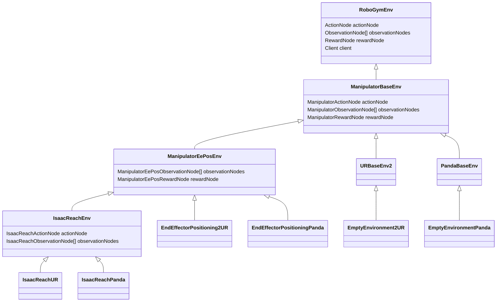

# Modular environments

We have started the creation of a new hierarchy of environment classes to improve the modularity and extensibility of our environments.

The base environment class is called RoboGymEnv. 
It lays out the common ground for robo-gym environments, such as the initialization of the client for the robot server and the functionality of the methods step and reset.
In terms of structure, the RoboGymEnv has components that we call nodes to take over elements of the environment's main functionality and to be specialized for different subclasses or configurations of environments:

* ActionNodes deal with the action from the agent and map it to the form that is understood by the robot server;
* ObservationNodes build parts of the observation from the state reported by the robot server; and
* RewardNodes provide the reward calculation and related data to be returned by  a step.

In general, an environment has one ActionNode, one RewardNode, and any number of ObservationNodes (reasoning for this multiplicity: for any given task, adding extra observations should be a relatively small change of implementation, such as additional sensors).
As for the environment itself, their initialization is largely driven by processing arguments. 
By default, the arguments that the nodes receive are equal to the ones of the environment, but the environment implementation has the freedom of preparing each node's arguments as required.

The functionality of the nodes is integrated into the environment's methods as needed and in a way that allows minimization duplicated code as much as possible. 
For example, the node types for actions and observations provide the respective methods for mapping messages (in opposite directions) that are used in the base environment's step method, so a specialized environment should not need to (but might) override the base step method. 
Also, the action space and observation space are calculated by the respective nodes. Nodes of all three types can contribute to the state data that is sent to the robot server in the course of a reset. This is useful in scenarios such as delegating the management of a target pose to the reward node, which can still provide the target data for the robot server.  

This new environment structure is used in a few concrete environments so far, some of which are designed to be direct replacements of our original environments.
The examples provided so far highlight a key benefit of the class hierarchy: Creating a variation of an environment should be possible with small additions and using as much of existing code as possible, without duplicating it. An example would be performing the same task with a different robot. We are already exploiting this potential with new environment implementations for the UR robots and corresponding environments for the same tasks with the Panda robot.
The environment classes that add specifics for a robot type are relatively short and simple, limited to configuring functionality provided by their base classes.

# Modular environment classes

This diagram sketches the relations between the provided environment classes so far in the hierarchy:

Note that the field indications are neither complete nor technically correct, as they are written like redefinitions with varying types. In fact, the fields are declared solely in the RoboGymEnv class and are only filled with instances of the corresponding subtypes by default. The notion in the diagram serves to illustrate how subclasses of the nodes can be used as needed for a certain environment type. Where possible, a less specialized node implementation may suffice. E.g., there is no special action node for the ManipulatorEePosEnv environment, but there are specific implementations of ObservationNode and RewardNode for it.

Our pre-existing environments have the convention of providing separate subclasses for simulated and real robot for each environment type, with class names and environment ids (for gym.make) obtained by adding the suffix "Sim" or "Rob". Due to changed logic in setting up the client for the robot server, this distinction is not technically necessary (setting a flag would be enough) for the new hierarchy, but to have matching names we also provide this specialization. Each leaf class in the diagram has two according not depicted subclasses with the appended "Sim" and "Rob".

## RoboGymEnv

As indicated above, the RoboGymEnv class is the base class in our hierarchy.

Note that, in contrast to our previous environments, it can work with pre-existing simulation robot servers (rather than only obtaining simulation robot servers from the server manager), which can save a lot of time during testing. However, as for a real robot server, it is necessary to make sure that the server is compatible with the environment. The roslaunch command to start the matching robot server for a given environment configuration can be read on the console output when starting the environment with a server manager address. Subsequently, the environment can be used with the address of the manually started server.

## ManipulatorBaseEnv

This environment class adds logic to control and observe a manipulator robot. It matches the previous empty UR environment on a logical level, however, it is independent of the robot type. There are subclasses for UR robots and for the Franka Emika Panda. The reward calculation is limited to surviving the maximum duration of the eposide without a collision.

## ManipulatorEePosEnv

The end-effector-positioning environment also correspond to the similarly named UR environment in our pre-existing set of classes, again with a robot-type-agnostic base class and subclasses for UR and Panda. As a new feature, the rotation of the end effector can be chosen to be considered in the reward calculation. Consequently, the tradition-based class name is accurate only if disabling this feature. There are richer options for determining the robot's starting pose (and whether the robot should return to it in reset) and for obtaining the target pose.

## IsaacReachEnv

This environment type and its subclasses are specializations of the ManipulatorEePosEnv class, intended to allow running agents trained with Isaac Lab in a robo-gym context. The special implementations of ActionNode and ObservationNode provide the corresponding mappings to the spaces as they are used by the supported agents in Isaac Lab. See also [Isaac Lab Compatibility](isaac_lab_compatibility.md)

In order to avoid a general dependency on Torch for robo-gym, the short code to load and interpret policies trained with Isaac Lab is included in the [robo_envtest](.\robo_envtest.py) example script. It comes into effect when passing the path of an exported trained policy from Isaac Lab. Specifically, the code supports policies trained with the rsl_rl train script that comes with Isaac Lab, tested with V4.5.0. Note that the export folder with this policy file is created upon running the rsl_rl play script and not during training itself.

# Open Issues (not comprehensive)

In general, it is intended to replace all of our old robo-gym environment implementations to the modular structure. Parts of this effort that are outside of the initial vertical slice implementation that ranges from the base environment down to the Isaac Reach task for UR and Panda remain to be done. While the process in ongoing, legacy implementations prevail (causing potentally confusing situations with environment names and mixed directories).

In some parts, the side goal of eliminating hardcoded values or other deficiencies is not yet reached. In particular, the construction of the roslaunch command in the robot-specific environment classes leaves a few things to be desired.

## MiR

The MiR environments have not yet been rebuilt with the new structure. The plan would be to have a base environment class for mobile robots as a sibling of the ManipulatorBaseEnv, with according task-specfic environment subclasses next and MiR-specific subclasses of those, next to other mobile robot types of interest.

## UR

The avoidance classes are left to be reconstructed in the modular fashion. Of course the implementation of avoidance-specific functionality would be robot-agnostic first and thus also compatible with other manipulator types.

## Panda

As of now, the Panda environments do not perform well. Attempts to use them with a real robot are strongly discouraged at this point. An overhaul of the server-side implementation may be necessary. Alternative approaches for action modes (in which actions don't correspond to absolute joint positions), preparations for which can be found on the server side and in unmerged branches, as well as many options in action execution and state collection have been tried but not yet led to satisfying results.

## Isaac Lab

There are other (example or custom) tasks that we would like to train for in Isaac Lab and provide execution for in robo-gym. It may be desirable to extract fields from configuration files/recordings from Isaac Lab; however, this may be outside of the scope of the environment classes themselves.

For the IsaacReachEnv, a shortcoming is that the server-side visualizations of the target do not correctly reflect the rotation of the target.
